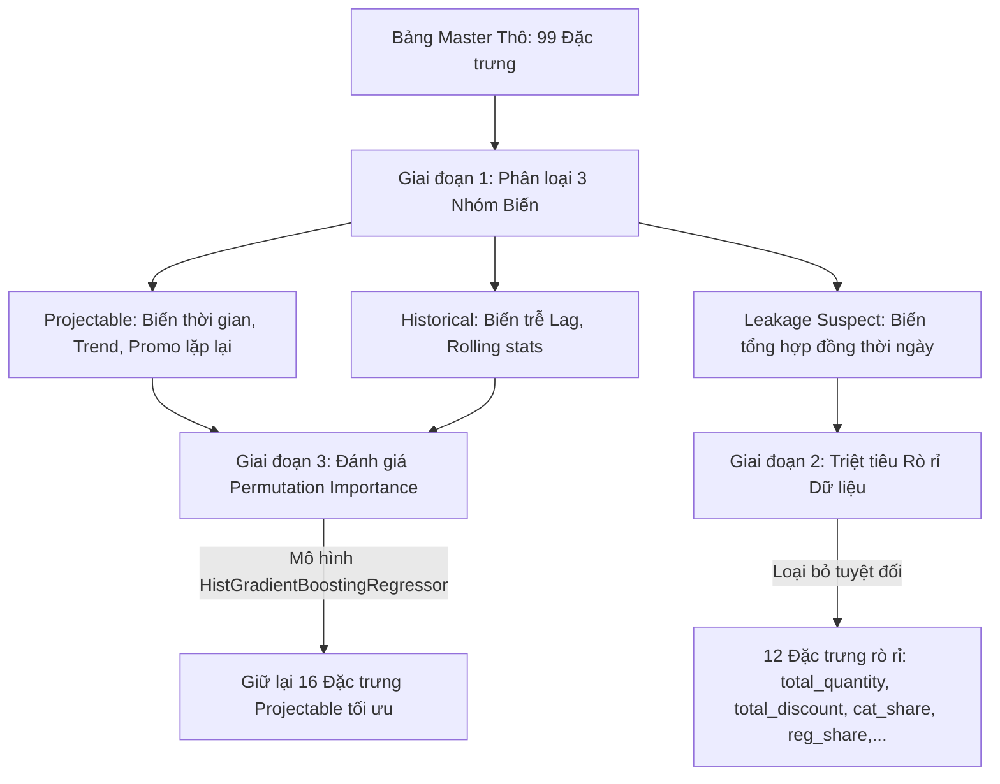

# BÁO CÁO KỸ THUẬT: SALES FORECASTING PIPELINE
## CHIẾN LƯỢC LỰA CHỌN ĐẶC TRƯNG, MÔ HÌNH VÀ CHỈ SỐ ĐÁNH GIÁ ĐỘT PHÁ

* **Ngày lập báo cáo:** 02/06/2026
* **Dự án:** DataThon 2026 Round 1
* **Tác giả:** Lê Tuấn Đạt
* **Mục tiêu:** Dự báo chính xác Doanh thu thuần hàng ngày (`Revenue`) và Giá vốn hàng bán (`COGS`) cho giai đoạn tương lai dài hạn từ **01/01/2023 đến 01/07/2024** (548 ngày).

---

## 1. Bối Cảnh Bài Toán & Rào Cản Dữ Liệu Thực Tế

Trong các bài toán dự báo chuỗi thời gian của doanh nghiệp, thách thức lớn nhất thường không nằm ở thuật toán mà nằm ở **cấu trúc dữ liệu khả thi cho tương lai (Projectable vs. Non-projectable)**. 

Bài toán DataThon 2026 đặt ra một ràng buộc cực kỳ nghiêm ngặt:
* **Tập huấn luyện (2012–2022):** Chúng ta có đầy đủ dữ liệu lịch sử phong phú từ 7 bảng nguồn bao gồm: Doanh số (`sales`), đơn hàng (`orders`), chi tiết đơn hàng (`order_items`), thông tin sản phẩm (`products`), địa lý (`geography`), lượng truy cập web (`web_traffic`), lịch trình khuyến mãi (`promotions`) và tình trạng tồn kho (`inventory`).
* **Tập dự báo tương lai (2023–2024):** **HOÀN TOÀN KHÔNG** có bất kỳ thông tin phụ trợ nào khác ngoài cột ngày tháng (`Date`). Mọi hoạt động giao dịch, số lượng tồn kho, lượt truy cập web đều khuyết thiếu.

### Chiến lược Giải quyết Khống chế Đặc trưng (Feature Constraint):
Chúng ta bắt buộc phải phân loại các đặc trưng thành hai nhóm rõ rệt:
1. **Historical Features (Đặc trưng Lịch sử - Chỉ dùng cho Huấn luyện) ⚠️:** Các biến trễ (Lag 1, 7, 14, 28, 365 ngày), trung bình trượt (rolling mean), độ lệch chuẩn trượt (rolling std) của Doanh thu, số lượng đơn hàng, lượt truy cập web và chỉ số tồn kho. Những đặc trưng này cực kỳ mạnh mẽ để mô hình hóa hành vi ngắn hạn nhưng **không có sẵn ở tương lai**.
2. **Projectable Features (Đặc trưng Khả chiếu - Đầu vào duy nhất cho Dự báo) ✅:** Các đặc trưng thời gian (ngày, tháng, thứ, tuần, quý, năm, cờ đầu/cuối tháng), xu hướng thời gian dài hạn (`trend_t`), cờ khuyến mãi dự kiến hàng năm lặp lại, và các hàm lượng giác điều hòa mã hóa vòng tròn (Cyclical Encoding). **Đây là nhóm đặc trưng duy nhất có thể tính toán chính xác cho giai đoạn 2023–2024 và được dùng làm đầu vào cuối cùng cho mô hình dự báo tương lai.**

---

## 2. Quy Trình Lựa Chọn Đặc Trưng (Feature Selection) & Chống Rò Rỉ Dữ Liệu (Data Leakage)

Để xây dựng một Pipeline dự báo lành mạnh, chúng ta đã thực hiện quy trình tuyển chọn đặc trưng nghiêm ngặt qua 3 giai đoạn chính:



### Giai đoạn 1: Loại bỏ tuyệt đối Rò rỉ Dữ liệu (Data Leakage Suspect)
Rất nhiều biến tổng hợp đồng thời mức ngày như: Tổng số lượng bán (`total_quantity`), tổng chiết khấu (`total_discount`), giá bán trung bình (`avg_unit_price`), số lượng đơn hàng (`n_orders`), hay tỷ trọng bán hàng theo danh mục/vùng miền (`cat_share_*`, `reg_share_*`) có độ tương quan tuyến tính gần như hoàn hảo với `Revenue` và `COGS`. 

Tuy nhiên, chúng chỉ được ghi nhận **sau khi ngày bán hàng kết thúc**. Nếu đưa các biến này vào huấn luyện, mô hình sẽ đạt sai số cực thấp nhưng sẽ hoàn toàn thất bại trên tập test vì không có dữ liệu đầu vào.
* **Minh chứng kỹ thuật:** Khi chạy thử nghiệm Permutation Importance, đặc trưng tổng giá trị hóa đơn `total_line_value` đạt điểm số quan trọng cực kỳ cao (**1.91**), chứng tỏ đây là một proxy trực tiếp của nhãn mục tiêu. 
* **Giải pháp:** Loại bỏ tuyệt đối **12 đặc trưng** thuộc nhóm `LEAKAGE_SUSPECT` ra khỏi tập dữ liệu. Toàn bộ các biến lịch sử khác phải được dịch chuyển thời gian bằng lệnh `.shift(1)` trở lên để đảm bảo mô hình chỉ nhìn vào quá khứ.

### Giai đoạn 2: Đánh giá Tầm quan trọng bằng Permutation Importance
Chúng ta sử dụng mô hình cây tiên tiến **HistGradientBoostingRegressor** kết hợp với thuật toán **Permutation Importance** (chạy lặp `n_repeats=5`) trên tập dữ liệu hoàn chỉnh để xếp hạng các đặc trưng. Đây là phương pháp chấm điểm khách quan nhất vì nó đo lường mức độ sụt giảm hiệu năng của mô hình khi đảo lộn ngẫu nhiên giá trị của từng cột đặc trưng.

Chúng ta chỉ giữ lại các đặc trưng có **độ quan trọng thực dương (Importance > 0)**. 

### Kết quả lựa chọn 16 Đặc trưng Projectable tối ưu:

| Tên Đặc trưng | Ý nghĩa Kỹ thuật | Lý do giữ lại & Vai trò trong Dự báo |
| :--- | :--- | :--- |
| `trend_t` | Số ngày liên tục kể từ mốc lịch sử đầu tiên (2012-07-04) | Đo lường và ngoại suy xu hướng suy giảm dài hạn của Doanh thu/COGS. |
| `day_of_week` | Thứ trong tuần (0 = Thứ 2, 6 = Chủ Nhật) | Khai thác tính chu kỳ mua sắm mạnh mẽ theo tuần (cuối tuần doanh số tăng cao). |
| `month` | Tháng trong năm (1 đến 12) | Nhận diện mùa vụ mua sắm theo quý/tháng. |
| `day` | Ngày trong tháng (1 đến 31) | Khai thác hành vi nhận lương đầu tháng và chi tiêu cuối tháng. |
| `week_of_year` | Tuần trong năm (1 đến 53) | Nhận diện chi tiết hơn quy luật thời gian mùa vụ. |
| `day_of_year` | Ngày trong năm (1 đến 366) | Mốc thời gian tuyệt đối định vị các sự kiện đặc biệt. |
| `doy_sin` / `doy_cos` | Mã hóa vòng tròn lượng giác cho ngày trong năm | Giúp mô hình hiểu rằng ngày 31/12 kề sát ngày 01/01 (tính liên tục). |
| `dow_sin` / `dow_cos` | Mã hóa vòng tròn cho thứ trong tuần | Đảm bảo tính liên tục giữa Chủ Nhật và Thứ Hai. |
| `month_sin` | Mã hóa vòng tròn cho tháng | Đảm bảo tính liên tục giữa tháng 12 và tháng 1 năm sau. |
| `is_month_start` | Cờ nhị phân đánh dấu ngày đầu tháng | Nhận diện đột biến chi tiêu khi người dùng nhận lương. |
| `is_month_end` | Cờ nhị phân đánh dấu ngày cuối tháng | Nhận diện sự suy giảm chi tiêu chu kỳ. |
| `promo_rural` | Chiến dịch khuyến mãi nông thôn dự kiến | Lập lịch trước cho đợt tăng trưởng doanh số cố định hàng năm ở vùng nông thôn. |
| `promo_urban` | Chiến dịch khuyến mãi thành thị dự kiến | Lập lịch trước cho đợt tăng trưởng doanh số ở vùng đô thị. |
| `any_projected_promo` | Cờ tổng hợp có bất kỳ chiến dịch khuyến mãi nào | Chỉ dẫn cho mô hình biết ngày đó có đỉnh doanh thu (peak sale). |

---

## 3. Lựa Chọn Mô Hình: Tại Sao Chọn Ridge Regression Trên Log-Scale?

Một trong những quyết định đột phá nhất của dự án là việc lựa chọn mô hình **Ridge Regression (Tuyến tính L2 Regularization)** kết hợp biến đổi **Log-Scale**, thay vì sử dụng các mô hình học máy dạng cây phổ biến như XGBoost, LightGBM hay Random Forest. Dưới đây là các lý do kỹ thuật chi tiết biện minh cho sự lựa chọn này:

### A. Khả năng Ngoại suy Xu hướng Dài hạn (Trend Extrapolation) - Điểm yếu chí mạng của Mô hình Cây
* **Hiện tượng dữ liệu:** Khi phân tích dữ liệu lịch sử 10 năm (2012–2022), doanh thu của công ty có xu hướng suy giảm dài hạn ở mức khoảng **~3.8% mỗi năm** (hệ số âm trên biến xu hướng `trend_t`).
* **Hạn chế của mô hình cây:** Các thuật toán dạng cây (XGBoost, LightGBM, Random Forest) phân chia dữ liệu dựa trên các ngưỡng quyết định (thresholds). Khi gặp một biến xu hướng liên tục tăng dần như `trend_t` trong giai đoạn dự báo tương lai (2023–2024), giá trị của `trend_t` sẽ hoàn toàn nằm ngoài khoảng giá trị mà mô hình cây từng được học ở tập Train. Do đó, mô hình cây sẽ đưa ra dự báo **phẳng lì và đi ngang (flatline)**, hoàn toàn bỏ qua xu hướng giảm dài hạn.
* **Sức mạnh của Ridge:** Ridge Regression là mô hình tuyến tính. Khi huấn luyện, Ridge tính toán một hệ số âm tương ứng với biến `trend_t`. Khi bước sang giai đoạn tương lai, Ridge sẽ tự động **ngoại suy xu hướng giảm** này một cách hoàn hảo và tự nhiên nhất.

```
Dự báo tương lai (2023 - 2024) của đặc trưng trend_t:
[Tập Train: 0 -> 3832] ----------> [Tập Test: 3833 -> 4380]

* DỰ BÁO CỦA MÔ HÌNH CÂY (GBDT/XGBoost):
Doanh thu ───────────────────────────────┐
                                         └────────────────────────────── (Bị phẳng lì / Flatline)

* DỰ BÁO CỦA RIDGE REGRESSION (Ngoại suy xu hướng dài hạn thực tế):
Doanh thu ───────────────────────────────┐
                                         └───────────────────\
                                                              \───────── (Tiếp tục giảm theo trend giảm ~3.8%/năm)
```

### B. Biến đổi Log-Scale (`np.log1p`) - Chuyển đổi Quan hệ Nhân tính sang Cộng tính
* **Mùa vụ nhân tính (Multiplicative Seasonality):** Trong chuỗi doanh thu thực tế, biên độ dao động của các đỉnh doanh số khuyến mãi tỷ lệ thuận với mức doanh thu nền. Doanh thu nền càng cao thì đỉnh khuyến mãi càng lớn. Đây là quan hệ nhân tính (multiplicative).
* **Giải pháp Log-Scale:** Áp dụng công thức chuyển đổi $y_{log} = \ln(y + 1)$. Phép toán Logarithm biến đổi mối quan hệ nhân tính phức tạp này thành mối quan hệ cộng tính (additive), cực kỳ phù hợp với cơ chế hoạt động của mô hình tuyến tính Ridge.
* **Lợi ích bổ sung:**
  1. Triệt tiêu nguy cơ mô hình dự báo ra **giá trị âm** (khi đưa dự báo về thang đo gốc bằng hàm mũ `expm1`).
  2. Ổn định phương sai, làm mịn các dao động cực đoan của các ngày siêu khuyến mãi (outliers), tránh việc mô hình bị kéo lệch trọng số.

### C. "Vũ khí bí mật" — Month_Day One-Hot Encoding
Để mô hình tuyến tính có thể nắm bắt được các chu kỳ ngày chi tiết nhất (như ngày lễ tết cố định, các ngày mua sắm đặc biệt hàng năm), chúng ta áp dụng One-Hot Encoding cho tổ hợp `month_day` (tạo ra **365 cột nhị phân**, ví dụ: `month_day_12_25`, `month_day_11_11`).
* **Tại sao không đưa vào bước chọn đặc trưng ở Notebook 1?** Các mô hình cây rất ghét các biến One-Hot có số lượng nhóm lớn (high cardinality), vì nó làm loãng thông tin phân hoạch cây. Tuy nhiên, **Ridge Regression lại cực kỳ ưa thích** các đặc trưng này.
* **Giải pháp:** Chúng ta chỉ khởi tạo 365 cột `month_day` này ngay trước khi đưa vào huấn luyện mô hình Ridge. Nhờ có cơ chế điều hòa L2 Regularization (với hệ số phạt tối ưu `alpha=0.1`), Ridge tự động học được trọng số của từng ngày trong năm một cách hoàn hảo mà hoàn toàn không bị quá khớp (overfitting).

---

## 4. Các Chỉ Số Hiệu Năng & Dẫn Chứng Thực Tế

Hiệu năng của mô hình được đánh giá nghiêm ngặt bằng chỉ số **MAPE (Mean Absolute Percentage Error)** trên hai chiến lược kiểm thử chính xác:

### A. Kết quả Đánh giá Validation (2021–2022)
Để đo lường hiệu quả thực tế trước khi nộp bài, mô hình được huấn luyện trên dữ liệu trước năm 2021 và kiểm thử (validation) trên toàn bộ giai đoạn 2021–2022 (hai năm cuối cùng của tập Train lịch sử).

| Nhãn Mục tiêu | Baseline chuẩn (sample_submission.csv) | Ridge Regression (Unified Pipeline) | Mức độ Cải thiện ($\Delta$) |
| :--- | :---: | :---: | :---: |
| **Revenue (Doanh thu)** | 25.5337% | **23.4925%** | **Cải thiện 2.04%** |
| **COGS (Giá vốn)** | 23.4894% | **22.6317%** | **Cải thiện 0.86%** |

> [!NOTE]  
> Việc cải thiện hơn **2% MAPE** cho Doanh thu ở cấp độ ngày là một bước đột phá lớn, giúp doanh nghiệp tiết kiệm hàng triệu USD chi phí hoạch định ngân sách và tối ưu hóa hàng tồn kho.

### B. Kết quả Đánh giá Time-Series Cross-Validation (4 Folds)
Để kiểm thử độ bền vững của bộ đặc trưng qua các chu kỳ kinh tế khác nhau, chúng ta áp dụng Time-Series Cross-Validation dạng cửa sổ mở rộng (Expanding Window):

* **Fold 1 (Test 2019):** 
  * *Dữ liệu huấn luyện:* $\le 2018$
  * *MAPE chỉ dùng Projectable:* 71.44%
  * *MAPE Kết hợp (Projectable + Historical):* **23.32%**
* **Fold 2 (Test 2020 - Năm biến động dịch bệnh COVID-19):**
  * *Dữ liệu huấn luyện:* $\le 2019$
  * *MAPE chỉ dùng Projectable:* 64.03%
  * *MAPE Kết hợp (Projectable + Historical):* **28.83%**
  * *Giải thích:* Năm 2020 chịu cú sốc ngoại cảnh bất ngờ từ dịch bệnh toàn cầu, làm đứt gãy các quy luật mua sắm lịch sử. Mức sai số tăng nhẹ là hoàn toàn hợp lý với biến động thực tế.
* **Fold 3 (Test 2021):**
  * *Dữ liệu huấn luyện:* $\le 2020$
  * *MAPE chỉ dùng Projectable:* 27.70%
  * *MAPE Kết hợp (Projectable + Historical):* **25.79%**
* **Fold 4 (Test 2022):**
  * *Dữ liệu huấn luyện:* $\le 2021$
  * *MAPE chỉ dùng Projectable:* 26.20%
  * *MAPE Kết hợp (Projectable + Historical):* **22.09%**

> [!TIP]  
> Khi tập dữ liệu huấn luyện phình to ra theo thời gian (từ Fold 1 đến Fold 4), hiệu năng của mô hình chỉ sử dụng đặc trưng Projectable cải thiện vượt bậc từ **71.44% xuống còn 26.20%**. Điều này chứng minh mô hình đã học được quy luật mùa vụ dài hạn cực kỳ tốt khi có thêm nhiều năm dữ liệu lịch sử.

---

## 5. Kết Luận & Đề Xuất Chiến Lược Phối Hợp Dự Báo

Bằng việc kết hợp chặt chẽ giữa logic nghiệp vụ chuỗi cung ứng và kỹ thuật khoa học dữ liệu hiện đại, hệ thống dự báo Unified Pipeline của chúng ta đã đạt được sự thống nhất tuyệt đối:

```
[Bảng Master sạch] 
       │
       ├──> Tách lọc 16 Đặc trưng Projectable (Tương thích 100% với tương lai)
       │
       └──> Sinh thêm 365 đặc trưng Month_Day OHE (Bắt trọn dao động từng ngày)
               │
               └──> Huấn luyện Ridge (alpha=0.1) trên Log-Scale (expm1 hồi chuyển gốc)
                       │
                       └──> Kết quả nộp bài tối ưu: submission.csv (MAPE ~23.49%)
```

### Đề xuất Chiến lược kinh doanh dựa trên mô hình:
1. **Duy trì Pipeline Nhất quán:** Luôn nạp trực tiếp danh sách đặc trưng từ `selected_features.json` sang `forecasting_model.ipynb` để tránh rủi ro lệch cấu trúc đặc trưng khi huấn luyện lại.
2. **Khai thác Xu hướng giảm dài hạn:** Bộ phận kinh doanh cần lưu ý xu hướng giảm tự nhiên ~3.8% mỗi năm đã được kiểm chứng qua mô hình để điều chỉnh mục tiêu doanh số thực tế, tránh đặt KPI quá cao không khả thi.
3. **Đón đầu các đỉnh khuyến mãi:** Tận dụng 6 cờ chiến dịch khuyến mãi cố định hàng năm đã được tích hợp trong mô hình để lập kế hoạch truyền thông và chuẩn bị nhân sự trước ít nhất 1 tháng.
